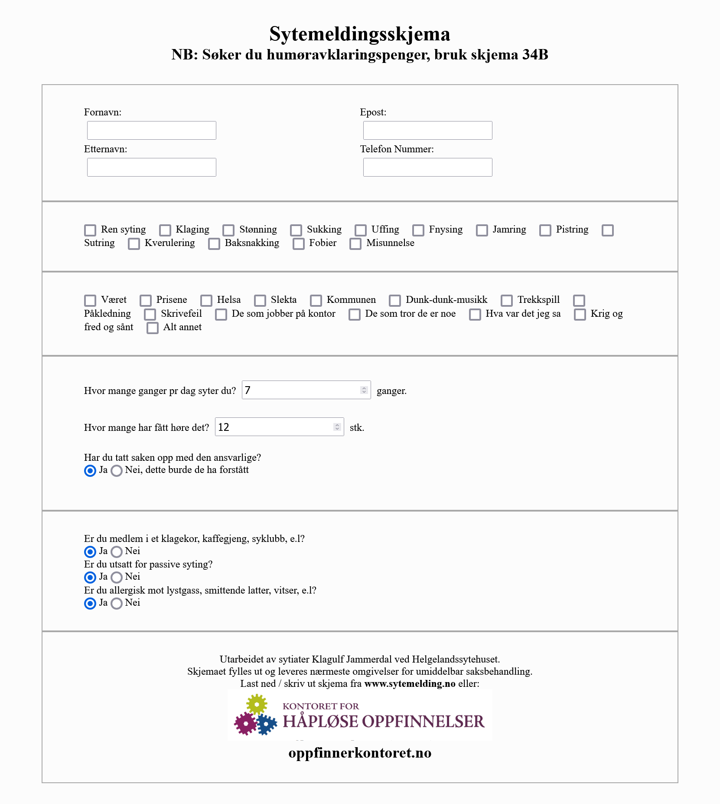

# HTML Form
 ### Task 3 - Create your own HTML form page
 
 This week at the "Kodehode" programming course, we've learned about HTML forms and tasked with creating a webpage utilizing what we have learned about HTML forms by creating our own.

 I decided to recreate "Sytemeldingsskjema" created by [Oppfinnerkontoret.no](https://oppfinnerkontoret.no/sytemelding/)

 